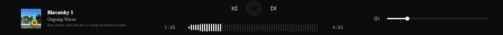

## Um pouco do plano de fundo

Tudo começou uns dias atrás quando recebi de um colega a preview do [Carta de Adeus](https://open.spotify.com/intl-pt/album/33vakWPP6Ze0sxf8A5kcss?si=YThQuMNXRvK9t7atE1ebTQ), vulgo disco novo da Fresno.

A preview estava hosteada no [Samply.app](https://Samply.app) e honestamente, eu fiquei pirado quando vi a plataforma e como que ela funcionava. Tinha aquela funcionalidade de fazer só uma coisa, mas ao mesmo tempo ter alguns 'bonus' e ainda assim fazer isso MUITO bem. Dito isso, ouvi algumas vezes o disco ao longo da semana e então eventualmente comecei a pensar em como eu poderia fazer algo semelhante, só pra entender como que funcionava.

Então surgiu o [TALISMAN](https://talisman-eight.vercel.app/).

A idéia era simples, construir um local que qualquer um poderia fazer o self host e gerenciar as informações sem depender de ninguem ou nenhum serviço. Ao mesmo tempo isso meio que foi uma nostalgia lááá do inicio quando comecei a tocar em umas bandas locais (mais ou menos em 2010), colocavamos as demos em [blogs](../building-this-blog/) ou em algumas redes sociais primordiais e era isso. Na época ter algo semelhante ao Talisman seria foda demais.

## Stack

O TALISMAN é construido em cima do Next.js, Tailwind, WaveSurfer.js e Lucide. Vou quebrar um pouco esses conceitos e falar sobre eles, nessa ordem.

Começando com o Next.js, inicialmente eu queria fazer um app fullstack com todas as funcionalidades encapsuladas em um lugar só, com um CMS no /admin MAAAAAAS ia ficar bem complexo até pra ser usado depois, então decidi a abordagem mais punk rock e simplificar. Ainda fiquei com o Next.js por trás, mas com a versão simplificada, digamos assim.

Tailwind foi outra escolha óbvia pra mim. Lá nos primordios eu era fã do Bootstrap e tava usando ele pras minhas aplicações até cerca de 2022. Comecei a ver alguns streamers que eu acompanho falando do Tailwind e construindo umas aplicações legais com ele e desde então tenho sido um adventor do Tailwind. Tudo é mais simples no quesito de não ter `aquela estetica` que os apps do Bootstrap sempre tem (e eu sei que tudo é customizavel, mas sejamos francos, 99% dos projetos não foram customizados), com isso eu meio que posso fazer o tailwind ser a paleta de cores que vou usar para pintar a minha idéia. Outra parada legal é que para os usuarios do app mobile, eu implementei um gesto de swipe bem parecido com o do Spotify, assim tu pode continuar navegando pela biblioteca.

WaveSurfer.js é uma biblioteca opensource de visualização de audio, ele pode gerar waveforms (aquelas ondinhas legais que representam o audio) e algumas outras paradas legais com o audio. No caso do TALISMAN, ele pega as fontes de audio dos discos/singles/eps e gera as waveworms para servir de barra de progresso ao invés de ter uma barra padrão. Dá pra ver um pouco melhor no print aqui em baixo, junto com Lucide que é a biblioteca de componentes de interface.

## O uso

Tu vais ter que hostear a fonte num repositorio, não importa se vai ser privado ou não, idealmente um clone do meu repositorio localmente pra fazer os ajustes de configuração de maneira mais eficiente e também testar algumas coisas antes de commitar na origem. Após isso, um `npm install` pra instalar tudo e ai um `npm run dev` pra rodar a brincadeira. Com isso, já está tudo pronto pra acessar o endpoint `/admin` para gerarmos as musicas e os eventos.

Lá na pagina, vais ter acesso a duas abas:

- Na primeira: Adicionar albuns e gerenciar musicas(que podem ser locais ou hosteadas).
- na Segunda: Editar eventos passados e criar eventos futuros, também vai ter um pequeno tutorial de como usar a pagina.

Essas alterações vão generar um `json` que vai servir como fonte para a aplicação, com dados das musicas, duração, cover art, hora e local dos eventos etc.

Após isso, só mandar ver no commit e no push pro repositorio e já era. Só integrar com a Vercel ou Cloudfare com um click.

## Curioso?

Vai lá, o repo tá aqui [TALISMAN](https://github.com/matheusdmm/TALISMAN). Pode fazer um fork ou auxiliar criando algumas features adicionais, me conta ai o que mais ia ser massa implementar?

Valeu demais, continua arrasando 🤘- Matheus.
